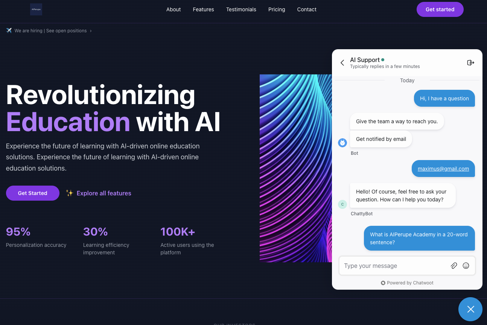
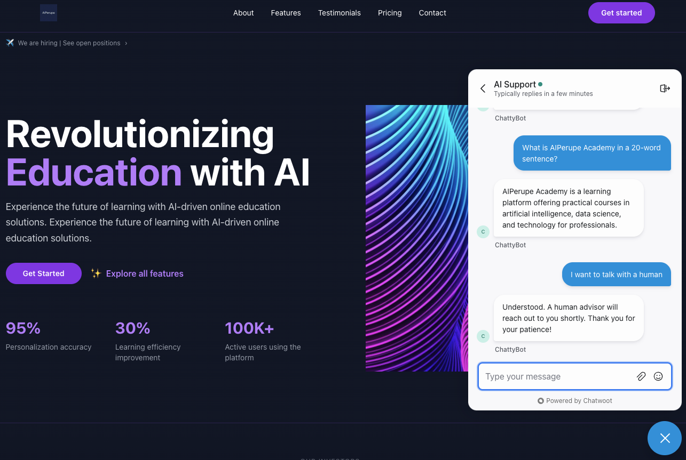
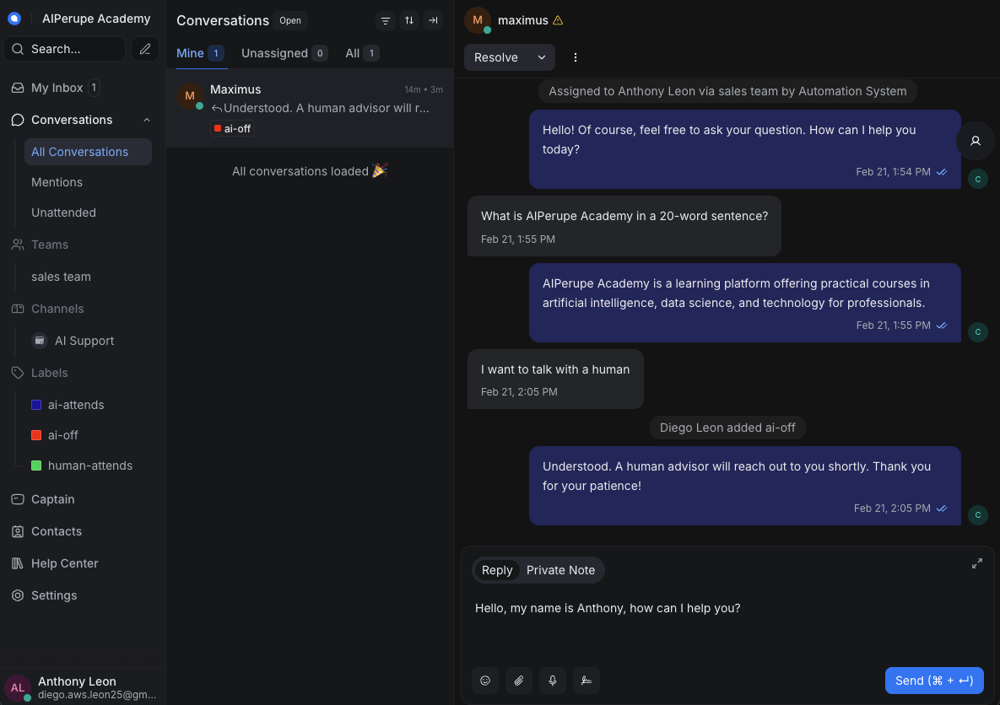
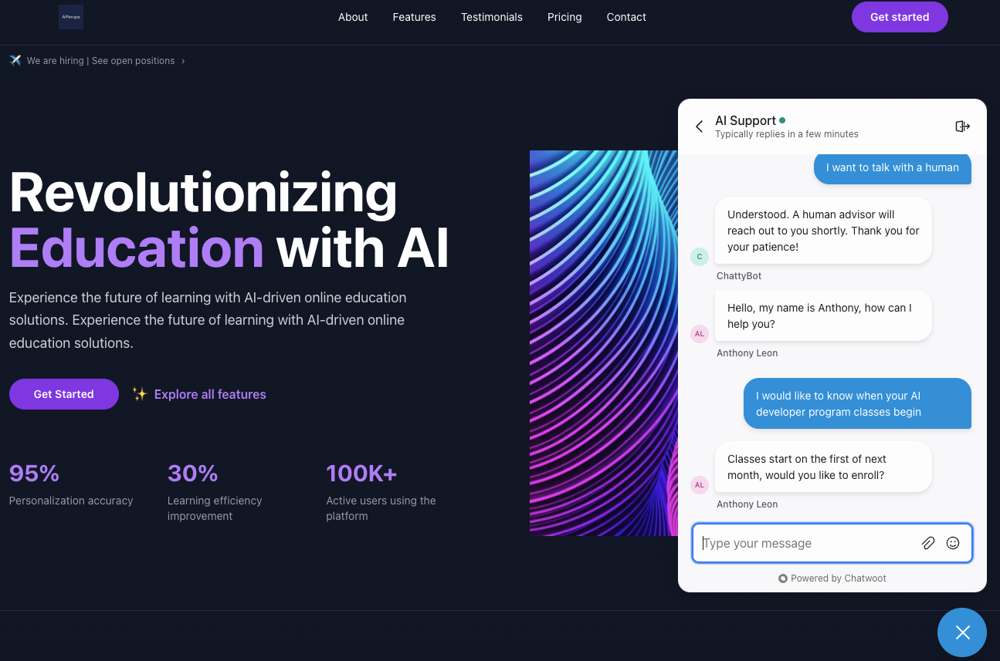
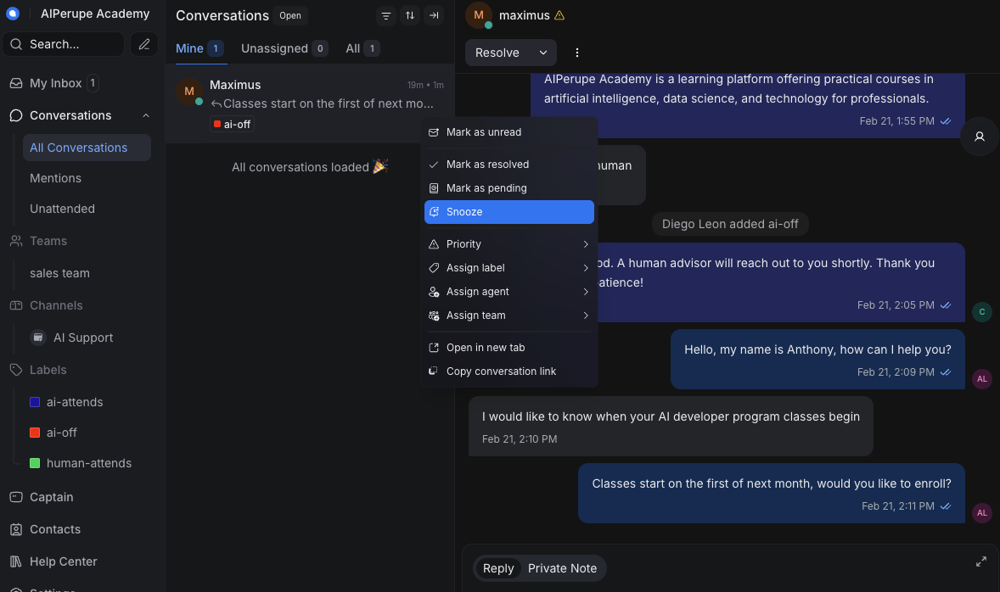
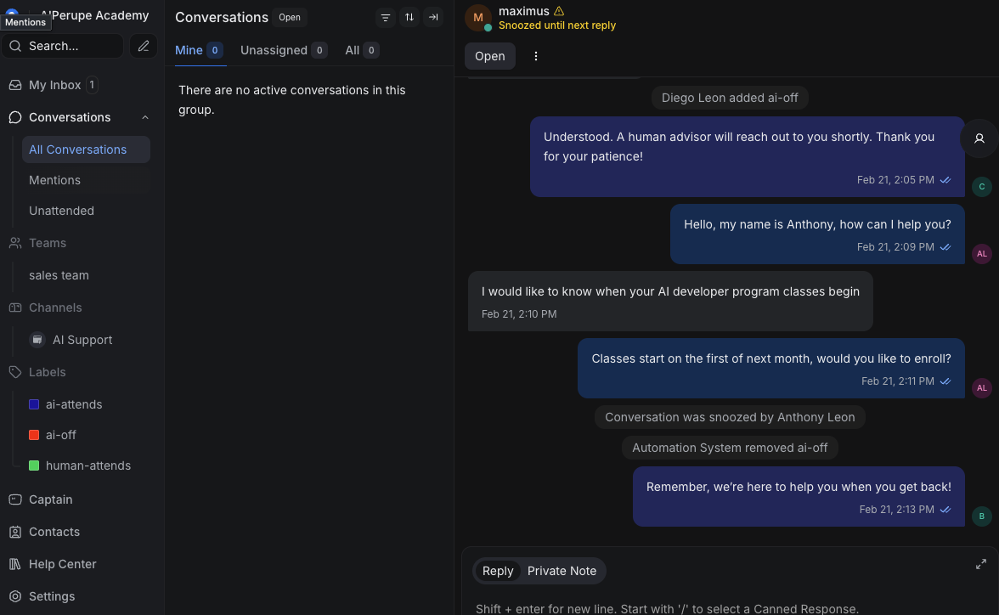
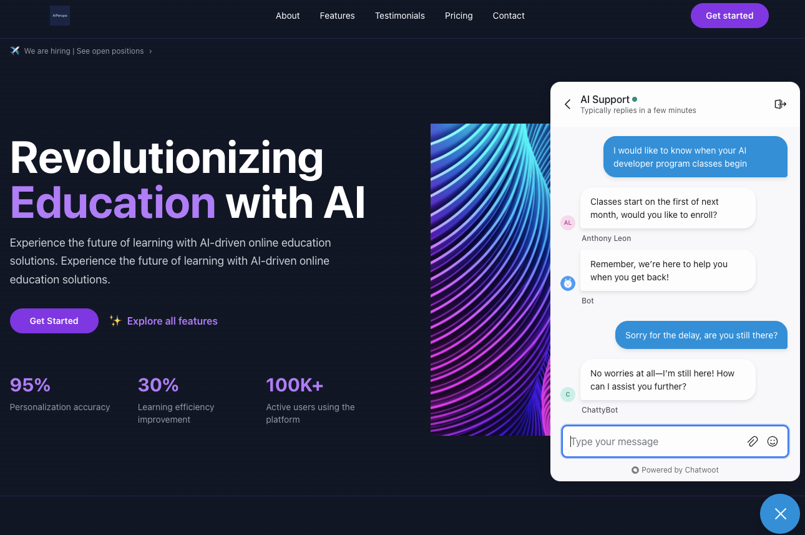
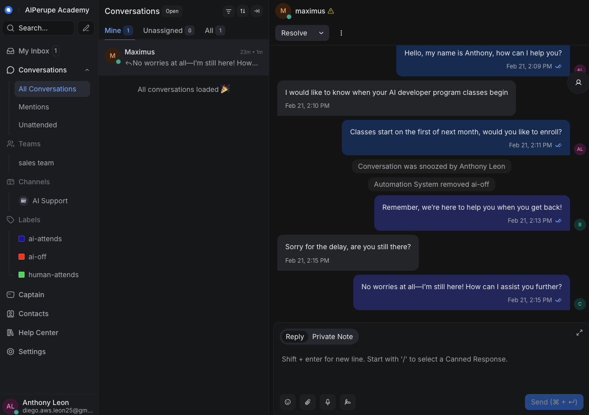

# LangChain Multi-Tool Agent + Chatwoot

Technical documentation for the AIPerupe Academy chatbot: a LangChain-based AI agent with conversation memory, RAG, and internet search, integrated with Chatwoot for live chat.

---

## Table of Contents

- [Technical Description](#technical-description)
- [Architecture Overview](#architecture-overview)
- [Technologies and Cloud Services](#technologies-and-cloud-services)
- [Project Structure](#project-structure)
- [Agent Evolution (01 → 04)](#agent-evolution-01--04)
- [Agent 04 and Chatwoot Entry Points](#agent-04-and-chatwoot-entry-points)
- [Chatwoot Installation](#chatwoot-installation)
- [Frontend with v0, Lovable or Similar Services](#frontend-with-v0-lovable-or-similar-services)
- [Installation & Setup](#installation--setup)
- [Running the Application](#running-the-application)
- [Usage Examples](#usage-examples)
- [Lessons Learned (Deployment & Chatwoot)](#lessons-learned-deployment--chatwoot)
- [Security and Best Practices](#security-and-best-practices)

---

## Technical Description

This project is an **AI Agent Orchestrator** that runs four progressively complex agents (01–04) and exposes **Agent 04** via a FastAPI web app that receives Chatwoot webhooks. The same Agent 04 logic (RAG + internet search + PostgreSQL conversation history) is reused across three Chatwoot modes: **opt-in**, **opt-out**, and **bot**.

- **Agents 01–04**: Run from the CLI via `main.py` (orchestrator) or directly from each agent folder. They evolve from stateless chat to memory + RAG + internet tools.
- **Chatwoot integration**: Implemented in `chatwoot_base.py`, which loads Agent 04 and exposes a single `/webhook` endpoint. Three entry points (`main_chatwoot_opt_in.py`, `main_chatwoot_opt_out.py`, `main_chatwoot_bot.py`) create the same app with different **label strategies** and optional **bot token** for identity.
- **Tools**: RAG over Supabase (`search_ai_perupe`), internet search via Tavily (`search_internet`). Conversation history is stored in PostgreSQL (e.g. Supabase pooler).

---

## Architecture Overview

```
┌──────────────────────────────────────────────────────────────────┐
│                    User / Chatwoot Widget                         │
└──────────────────────┬────────────────────────────────────────────┘
                       │  Chatwoot UI
                       ▼
┌──────────────────────────────────────────────────────────────────┐
│                     Chatwoot Server                               │
│  (message_created → POST /webhook to your app)                    │
└──────────────────────┬────────────────────────────────────────────┘
                       │  HTTP POST /webhook
                       ▼
┌──────────────────────────────────────────────────────────────────┐
│              FastAPI Backend (chatwoot_base.py)                   │
│                                                                  │
│  ┌─────────────────┐  ┌──────────────┐  ┌─────────────────────┐ │
│  │  GET /           │  │  GET /health │  │  GET /test           │ │
│  └─────────────────┘  └──────────────┘  └─────────────────────┘ │
│                                                                  │
│  ┌─────────────────────────────────────────────────────────────┐│
│  │  POST /webhook → Agent 04 (agent_chat_memory_rag_web.py)     ││
│  │  chat_with_agent(message, session_id)                        ││
│  │  ┌─────────────────┐  ┌─────────────────┐                    ││
│  │  │ search_ai_perupe │  │ search_internet │  (Tavily)          ││
│  │  │ (RAG / Supabase) │  │                 │                    ││
│  │  └────────┬────────┘  └────────┬────────┘                    ││
│  │           │                     │                            ││
│  │           ▼                     ▼                            ││
│  │  ┌─────────────────────────────────────────────────────────┐ ││
│  │  │           OpenAI (LLM + embeddings)                      │ ││
│  │  └─────────────────────────────────────────────────────────┘ ││
│  └─────────────────────────────────────────────────────────────┘│
└──────────────────────┬────────────────────┬─────────────────────┘
                        │                    │
        ┌───────────────┘                    └───────────────┐
        ▼                                                    ▼
┌─────────────────────────────┐    ┌────────────────────────────────┐
│  Supabase (PostgreSQL)       │    │  Supabase (RAG)                 │
│  chat_history (session_id)   │    │  documents_langchain_...        │
│  Conversation memory         │    │  pgvector + match_documents_...  │
└─────────────────────────────┘    └────────────────────────────────┘
```

**Key points:**

- **No message queues or event-driven architecture** — Synchronous request/response. Chatwoot sends one webhook per message; the app processes it and POSTs the reply back to Chatwoot’s API.
- **Single-service deployment** — One FastAPI process (uvicorn) loads Agent 04 at startup and serves `/webhook`, `/`, `/health`, `/test`. No separate microservices in this repo.
- **Stateful** — Conversation history is persisted in PostgreSQL (`chat_history` via `PostgresChatMessageHistory`). Session ID is derived from Chatwoot `conversation_id` so the same thread keeps context.

---

## Technologies and Cloud Services

| Layer | Technology |
|-------|------------|
| Runtime | Python 3.11 (see `Dockerfile`) |
| Framework | FastAPI, Uvicorn (`requirements.txt`) |
| LLM / Agent | LangChain ≥1.0 (`langchain`, `langchain-openai`), OpenAI GPT-4o (`init_chat_model("gpt-4o")` in agents) |
| Conversation history | PostgreSQL (`langchain-postgres`, `psycopg`); table `chat_history` created in code via `PostgresChatMessageHistory.create_tables`. |
| RAG | Supabase table `documents_langchain_sales_assistant` (`tools/knowledge_base.py`), OpenAI `text-embedding-ada-002`, numpy cosine similarity (in-process). |
| Internet search | Tavily (`langchain-tavily`, `tools/internet_search.py`) |
| Chatwoot | REST: webhook inbound, `send_message` / `update_labels` outbound (`chatwoot_base.py`) |
| Env / config | `python-dotenv`, `.env` (see `.gitignore`) |

---

## Project Structure

```
.
├── main.py                          # CLI orchestrator — menu to run agents 01–04
├── main_chatwoot_bot.py             # Chatwoot entry: bot mode (CHATWOOT_BOT_TOKEN)
├── main_chatwoot_opt_in.py           # Chatwoot entry: opt-in (label ai-attends/human-attends)
├── main_chatwoot_opt_out.py          # Chatwoot entry: opt-out (label ai-off to disable)
├── chatwoot_base.py                  # FastAPI app factory, /webhook, loads Agent 04
├── requirements.txt                  # Python dependencies
├── Dockerfile                        # Production container (uvicorn main_chatwoot_bot:app)
├── build.sh                          # Docker build helper (multi-arch)
├── .env                              # Environment variables (not in repo; see .gitignore)
├── .gitignore
├── .dockerignore                     # Excludes .env, venv, README, etc. from build context
├── 01-agent-chat/
│   └── agent_chat.py                 # Agent 01: basic chat, no memory
├── 02-agent-chat-memory/
│   └── agent_chat_memory.py          # Agent 02: chat + PostgreSQL conversation history
├── 03-agent-chat-memory-rag/
│   └── agent_chat_memory_rag.py      # Agent 03: memory + RAG tool (search_ai_perupe)
├── 04-agent-chat-memory-rag-web/
│   └── agent_chat_memory_rag_web.py  # Agent 04: memory + RAG + Tavily; chat_with_agent()
├── tools/
│   ├── __init__.py
│   ├── knowledge_base.py             # search_ai_perupe (Supabase)
│   └── internet_search.py            # search_internet (Tavily)
└── assets/
    ├── prompt.txt                    # Script snippet for Chatwoot widget
    ├── landing-reference.png         # Landing reference image
    └── step-1.png … step-8.png       # Example flow screenshots
```

---

## Agent Evolution (01 → 04)

| Agent | Folder | Description | Memory | Tools |
|-------|--------|-------------|--------|-------|
| **01** | `01-agent-chat/` | Basic chat, no memory. Single prompt + LLM (GPT-4o). | None | None |
| **02** | `02-agent-chat-memory/` | Same model + prompt, with **persistent conversation history** in PostgreSQL via `langchain_postgres.PostgresChatMessageHistory`. Session identified by UUID. | PostgreSQL | None |
| **03** | `03-agent-chat-memory-rag/` | Adds **RAG as a tool**: `search_ai_perupe` (Supabase knowledge base). LLM decides when to call the tool. History still in PostgreSQL. | PostgreSQL | `search_ai_perupe` |
| **04** | `04-agent-chat-memory-rag-web/` | Adds **internet search** tool (`search_internet`, Tavily). Full stack: memory + RAG + web. Exposes `chat_with_agent(message, session_id)` used by Chatwoot. | PostgreSQL | `search_ai_perupe`, `search_internet` |

Evolution summary:

1. **01** – Stateless; each turn is independent.
2. **02** – Stateful; `RunnableWithMessageHistory` + `PostgresChatMessageHistory` and table `chat_history`.
3. **03** – Tool-calling agent with one tool (RAG); manual message accumulation and tool execution loop; history still in PostgreSQL.
4. **04** – Same pattern as 03 with two tools; `chat_with_agent` is the single entry used by the Chatwoot webhook.

---

## Agent 04 and Chatwoot Entry Points

**Agent 04** is the only agent integrated with Chatwoot. It is loaded once in `chatwoot_base.py` from `04-agent-chat-memory-rag-web/agent_chat_memory_rag_web.py` and its `chat_with_agent(message, session_id)` is used for every incoming webhook message. Session ID is derived from Chatwoot `conversation_id` via a deterministic UUID so the same conversation keeps the same memory.

| Entry point | File | Mode | Behavior |
|-------------|------|------|----------|
| **Orchestrator** | `main.py` | CLI | Menu to run agent 1, 2, 3, or 4 in the terminal. Agent 04 runs the same CLI loop as in its folder. |
| **Opt-in** | `main_chatwoot_opt_in.py` | `opt_in` | Responds only when the conversation has the activation label (env `CHATWOOT_BOT_LABEL`, default `ai-attends`). Uses `CHATWOOT_API_ACCESS_TOKEN`. |
| **Opt-out** | `main_chatwoot_opt_out.py` | `opt_out` | Responds to all conversations unless the disable label is present (env `CHATWOOT_AI_OFF_LABEL`, default `ai-off`). Uses `CHATWOOT_API_ACCESS_TOKEN`. |
| **Bot** | `main_chatwoot_bot.py` | `bot` | Same label logic as opt-out; replies use `CHATWOOT_BOT_TOKEN` when set, so messages appear as the bot (see `send_message(..., token)` in `chatwoot_base.py`). |

All three Chatwoot entry points use the same FastAPI app factory `create_app(config)` in `chatwoot_base.py`; only `mode` and optional `label`/token differ. The Dockerfile runs `main_chatwoot_bot:app` by default.

---

## Chatwoot Installation

You need a Chatwoot instance that can POST webhooks to your app and that your app can call (see `send_message`, `update_labels` in `chatwoot_base.py`). This repo does not include Chatwoot manifests. For setup options (Docker Compose, EasyPanel, Dokploy), see [Chatwoot self-hosted](https://www.chatwoot.com/docs/self-hosted).

In Chatwoot you must also:

- **Create an Inbox** (e.g. website channel) so the widget can connect and messages reach your app; the inbox gives you the widget script and the `websiteToken` used in `assets/prompt.txt`.
- **Create human agents** (team members) if you use handoff; the app adds labels like `human-attends` so a human can take over.
- **Create labels** used by the app: at least the activation label (e.g. `ai-attends` for opt-in) and/or the disable label (e.g. `ai-off` for opt-out/bot). Create these in Chatwoot so they can be assigned to conversations.
- **Create the bot** (optional): in bot mode, create a Bot in Chatwoot and use its token as `CHATWOOT_BOT_TOKEN` so replies appear with the bot’s name and avatar.
- **Create automation rules** (optional): use Chatwoot’s **Automation** (e.g. *Settings → Automation*) to react to conversation updates. Example rules used in this setup:
  - **innactivity-customer** — Event: *Conversation Updated*. Condition: *Status* equal to *Snoozed*. Action: *Remove a Label* → `ai-off`. So when a conversation is snoozed, `ai-off` is removed and the bot can respond again when it is reopened.
  - **assign-sales-team** — Event: *Conversation Updated*. Condition: *Status* equal to *Open*. Action: *Assign a Team* → e.g. sales team. Assigns new/open conversations to the right team.
  - **snoozed_message_reminder** — Event: *Conversation Updated*. Condition: *Status* equal to *Snoozed*. Action: *Send a Message* → e.g. “Remember, we're here to help you when you get back!”. Sends an automatic reminder when the conversation is snoozed.

**Example flow of the app (visual)**

The following describes the **full flow of the app as the user sees it** in the Chatwoot widget. It applies especially in **opt-out or bot mode** (where the label `ai-off` is used to pause the bot).

1. **The client has a query and is asked for their email; the conversation with the bot begins.**



2. **The bot replies until the client asks to talk to a human.**



3. **An automation rule created by the Chatwoot administrator (Diego Leon) assigns the conversation to the sales team (Anthony Leon).**



4. **Consultations are delegated to a human agent.**



5. **The client stops replying and the human agent selects the Snooze option.**



6. **The client is Snoozed until next reply and the conversation moves to the human agent's inbox. Then two inactivity automation rules run: one removes the `ai-off` label so the bot can attend when the client returns, and one sends a reminder message.**



7. **The client returns and the bot responds until the client asks to talk to a human again.**



8. **When the client returns, the conversation is assigned again to the sales team, who are waiting for clients who want to talk to them.**



Configure the webhook URL in Chatwoot to `https://<your-app-host>/webhook`.

---

## Frontend with v0, Lovable or Similar Services

- **`assets/prompt.txt`** — Example Chatwoot widget script (uses `BASE_URL` and `websiteToken`; see file contents). Use as template and replace with your Chatwoot inbox values.
- **`assets/landing-reference.png`** — Reference image (present in repo).


To test locally, expose the app with [ngrok](https://ngrok.com) (e.g. `ngrok http 8000`) and set the Chatwoot webhook to `https://<ngrok-host>/webhook`.

---

## Prerequisites

- **Python 3.11+**
- **PostgreSQL** (or Supabase with session pooler) for conversation history
- **Supabase project** for RAG (table + embeddings)
- **OpenAI API key** and **Tavily API key** (create an account at [Tavily](https://tavily.com) to obtain `TAVILY_API_KEY` for the `search_internet` tool)
- **Chatwoot instance** (see [Chatwoot Installation](#chatwoot-installation))
- **Docker** (optional, for containerized deployment)

---

## Installation & Setup

### 1. Clone the Repository

```bash
git clone https://github.com/DLeon24/langchain-multi-tool-agent-chatwoot.git
cd langchain-multi-tool-agent-chatwoot
```

### 2. Create and Activate a Virtual Environment

```bash
python3 -m venv venv
source venv/bin/activate   # macOS / Linux
# venv\Scripts\activate    # Windows
```

### 3. Install Dependencies

```bash
pip install -r requirements.txt
```

### 4. Configure Environment Variables

Create a `.env` file in the project root with the following variables. Do not commit real keys.

| Variable | Required | Description |
|----------|----------|-------------|
| `OPENAI_API_KEY` | Yes | OpenAI API key for LLM and embeddings. |
| `DB_USER` | Yes | PostgreSQL user (e.g. Supabase pooler user). |
| `DB_PASSWORD` | Yes | PostgreSQL password. |
| `DB_HOST` | Yes | PostgreSQL host (e.g. `aws-0-us-west-2.pooler.supabase.com`). |
| `DB_PORT` | No | Default `5432`. |
| `DB_NAME` | No | Default `postgres`. |
| `SUPABASE_URL` | Yes | Supabase project URL for RAG. |
| `SUPABASE_SERVICE_KEY` | Yes | Supabase service role key (for RAG table). |
| `TAVILY_API_KEY` | Yes | Tavily API key for `search_internet`. Create an account at [Tavily](https://tavily.com) to get it. |
| `CHATWOOT_BASE_URL` | For Chatwoot | Chatwoot base URL (e.g. `https://chatwoot.example.com`). |
| `CHATWOOT_ACCOUNT_ID` | For Chatwoot | Chatwoot account ID. |
| `CHATWOOT_API_ACCESS_TOKEN` | For Chatwoot | Chatwoot API token (admin/agent). Used for sending messages and updating labels. |
| `CHATWOOT_BOT_LABEL` | No | Opt-in label (default `ai-attends`). |
| `CHATWOOT_AI_OFF_LABEL` | No | Opt-out/bot disable label (default `ai-off`). |
| `CHATWOOT_BOT_TOKEN` | For bot mode | Optional; if set, bot-mode replies use this so the message appears as the bot. |

**Chatwoot webhook**

In Chatwoot: add an **Integration** or **Webhook** that sends events to your app. The endpoint must be:

- `https://<your-app-host>/webhook`

Your app must be reachable from the internet (e.g. deployed or via ngrok). For local dev, use ngrok:

```bash
ngrok http 8000
```

Then set the webhook URL in Chatwoot to `https://<ngrok-host>/webhook`.

**Cloudflare (or similar) in front of Chatwoot**

If Chatwoot or your bot is behind Cloudflare, security rules can block webhooks or API calls. See [Lessons Learned](#lessons-learned-deployment--chatwoot) for a rule that allows the webhook and API paths.

### 5. Set Up PostgreSQL and Supabase

- **`chat_history`** — Created in code when you run Agent 02, 03, or 04: each calls `PostgresChatMessageHistory.create_tables(sync_connection, "chat_history")` (see `agent_chat_memory.py`, `agent_chat_memory_rag.py`, `agent_chat_memory_rag_web.py`). No manual SQL required.
- **RAG table** — The tool `search_ai_perupe` reads from the Supabase table `documents_langchain_sales_assistant` (`tools/knowledge_base.py`). This repo does not create it. To create the table (and schema), use the [rag-agent-chatbot](https://github.com/DLeon24/rag-agent-chatbot) project: run `supabase-scripts/script.sql` in your Supabase SQL Editor.

### 6. Start the Server

See [Running the Application](#running-the-application) for the different ways to run the orchestrator, Agent 04, or the Chatwoot integration.

---

## Running the Application

The API listens on `http://0.0.0.0:8000` (see `uvicorn.run(..., host="0.0.0.0", port=8000)` in `chatwoot_base.py`). Interactive docs: `http://localhost:8000/docs`.

### Ingest the Knowledge Base

RAG is used **from Agent 03 onward** (Agent 03 and Agent 04). The tool `search_ai_perupe` reads from the Supabase table `documents_langchain_sales_assistant` (see `tools/knowledge_base.py`). This project has no ingest endpoint. Populate that table (e.g. using [rag-agent-chatbot](https://github.com/DLeon24/rag-agent-chatbot): run `supabase-scripts/script.sql` in Supabase, then that project’s GET `/rag` to ingest the PDF). Once the table has documents, Agent 03, Agent 04 and the `/test` endpoint can use the tool.

### Run the Orchestrator (all agents from CLI)

```bash
python main.py
```

Then choose 1, 2, 3, or 4 to run the corresponding agent.

### Run Agent 04 Only (CLI, no Chatwoot)

```bash
python 04-agent-chat-memory-rag-web/agent_chat_memory_rag_web.py
```

### Run the Chatwoot Integration

Start one of the following depending on the desired mode. The server listens on `http://0.0.0.0:8000`.

```bash
# Opt-in mode (responds only when label "ai-attends" is present)
python main_chatwoot_opt_in.py

# Opt-out mode (responds to all except "ai-off")
python main_chatwoot_opt_out.py

# Bot mode (opt-out + replies as bot via CHATWOOT_BOT_TOKEN)
python main_chatwoot_bot.py
```

### Docker (optional)

The Dockerfile runs the bot app by default. Build with the provided script:

```bash
chmod +x build.sh
./build.sh <dockerhub_user> <version> <arch>
# Example: ./build.sh myuser 1.0.0 amd64
```

Or build and run manually:

```bash
docker build -t langchain-multitool-agent-chatwoot:latest .
docker run -p 8000:8000 --env-file .env langchain-multitool-agent-chatwoot:latest
```

---

## Usage Examples

### 1. Call the agent via the test endpoint (no Chatwoot)

```bash
curl -X POST http://localhost:8000/test \
  -H "Content-Type: application/json" \
  -d '{"message": "What courses does AIPerupe offer?", "session_id": "test-session-1"}'
```

Expected: JSON with `message`, `session_id`, `response`, `status` (`"success"` or `"error"`); see `chatwoot_base.py` test endpoint.

### 2. Health check

```bash
curl http://localhost:8000/health
```

Expected: `status`, `agent` (`"Agent 04"`), `chatwoot` (`"connected"` or `"not configured"`); see `chatwoot_base.py` health endpoint.

### 3. Root (service info)

```bash
curl http://localhost:8000/
```

Returns `service`, `version`, `agent`, `model`, `tools`, `mode`, `label`, `chatwoot_configured`, `status` (and `bot_token_configured` in bot mode); see `read_root()` in `chatwoot_base.py`.

### 4. Simulating a Chatwoot webhook (for debugging)

The webhook handler in `chatwoot_base.py` reads: `event`, `message_type`, `content`, `conversation` (with `id`, `labels`). It only processes `event == "message_created"` and `message_type == "incoming"`.

Example (replace with your payload shape if different):

```bash
curl -X POST http://localhost:8000/webhook \
  -H "Content-Type: application/json" \
  -d '{
    "event": "message_created",
    "message_type": "incoming",
    "content": "Hello, what courses do you have?",
    "conversation": { "id": 1, "labels": ["ai-attends"] }
  }'
```

Behavior depends on mode and labels: opt-in requires the activation label; opt-out/bot respond unless the disable label is present.

---

## Lessons Learned (Deployment & Chatwoot)

1. **Cloudflare (or similar) blocking webhooks**  
   If the bot or Chatwoot is behind Cloudflare, strict firewall/WAF rules can block:
   - Incoming webhooks from Chatwoot to your app (`/webhook`).
   - Outgoing requests from your app to Chatwoot (e.g. `https://chatwoot.example.com/api/v1/...`).

   A rule that **allows** the webhook and Chatwoot API paths while restricting other traffic (e.g. by country) can look like this (Cloudflare expression):

   ```text
   (ip.src.country ne "PE" and http.request.uri.path ne "/webhook" and not http.request.uri.path contains "/api/v1/")
   ```

   Interpretation: “Apply this rule (e.g. block or challenge) when: country is not PE **and** path is not `/webhook` **and** path does not contain `/api/v1/`.” So traffic to `/webhook` and to `*/api/v1/*` is allowed from any country; other paths are subject to the rule (e.g. only allow PE). Adjust country and paths to match your policy.

2. **Webhook URL must be HTTPS and reachable**  
   Chatwoot must POST to a public URL. Use a tunnel (ngrok, Cloudflare Tunnel) in dev and a proper domain in production.

3. **Labels and tokens** — Opt-in: activation label required (`CHATWOOT_BOT_LABEL`). Opt-out/Bot: disable label `CHATWOOT_AI_OFF_LABEL` (default `ai-off`). Bot mode: set `CHATWOOT_BOT_TOKEN` for bot identity (see `_bot_strategy` in `chatwoot_base.py`).  

4. **Human handoff** — If the message contains any of `HUMAN_KEYWORDS` (see `chatwoot_base.py`: human, person, advisor, agent, representative, talk to someone), the app calls `update_labels` (e.g. adds `human-attends`) and sends `HANDOFF_MESSAGE`.

---

## Security and Best Practices

- **Secrets** — `.env` is in `.gitignore` and excluded from the Docker build (`.dockerignore`). Pass secrets at runtime (e.g. `--env-file`).
- **Webhook validation** — The webhook handler in `chatwoot_base.py` does not verify request signatures.
- **Paths** — The app exposes `/`, `/health`, `/test`, `/webhook`; outbound calls to Chatwoot use `/api/v1/accounts/.../conversations/...` (see `send_message`, `update_labels`).
- **Database** — DB connection is built from env vars only (`DB_USER`, `DB_PASSWORD`, `DB_HOST`, etc.); no credentials in code.

---